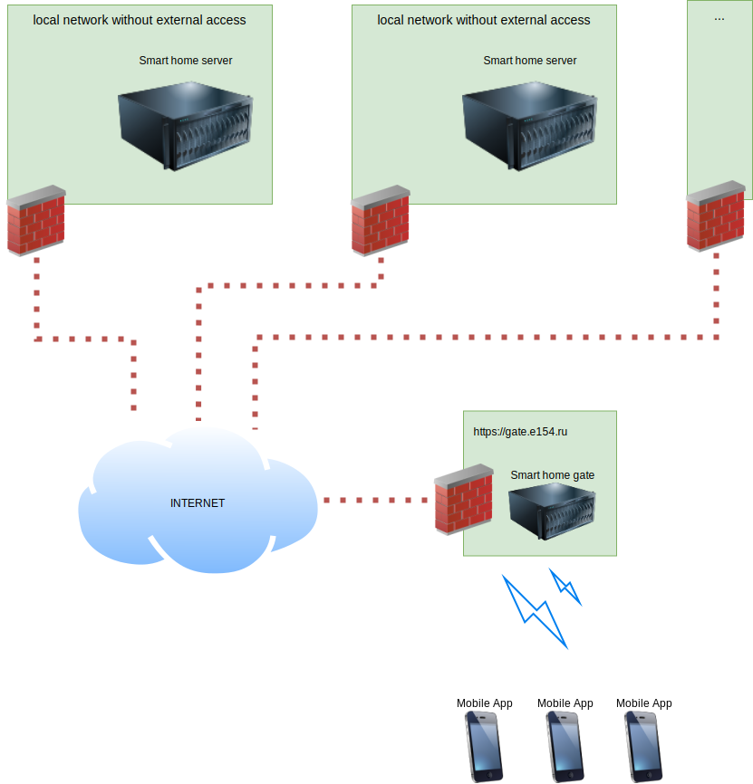
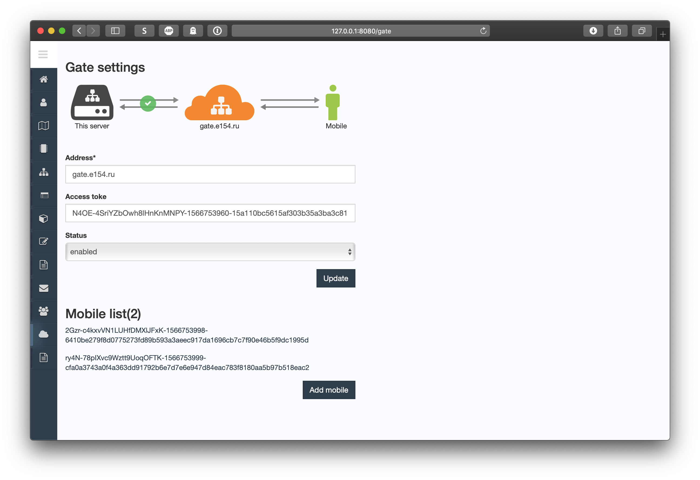

Smart home mobile gate
-----------------------

[Project site](https://e154.github.io/smart-home/) |
[Server](https://github.com/e154/smart-home/) |
[Configurator](https://github.com/e154/smart-home-configurator/) |
[Node](https://github.com/e154/smart-home-node/) |
[Smart home Socket](https://github.com/e154/smart-home-socket/) |
[Modbus device controller](https://github.com/e154/smart-home-modbus-ctrl-v1/)

[](https://travis-ci.org/e154/smart-home-gate)

[](https://opensource.org/licenses/MIT)

Attention! The project is under active development.
---------

Gateway for connecting mobile clients to the server **smart home**. Controls access rights in accordance with the selected policy.
Determining whether a client belongs to a server occurs through an access token issued to the client.
It is possible to connect a large number of servers and client applications to the server at the same time.





### Installation for development

```bash
go get -u github.com/golang/dep/cmd/dep

git clone https://github.com/e154/smart-home-gate $GOPATH/src/github.com/e154/smart-home-gate

cd $GOPATH/src/github.com/e154/smart-home-gate

dep ensure

go build
```

editing configuration files

```bash
cp conf/config.dev.json conf/config.json

```

run server

```bash
./smart-home-gate
```

It's all

### LICENSE

[MIT Public License](https://github.com/e154/smart-home-gate/blob/master/LICENSE)